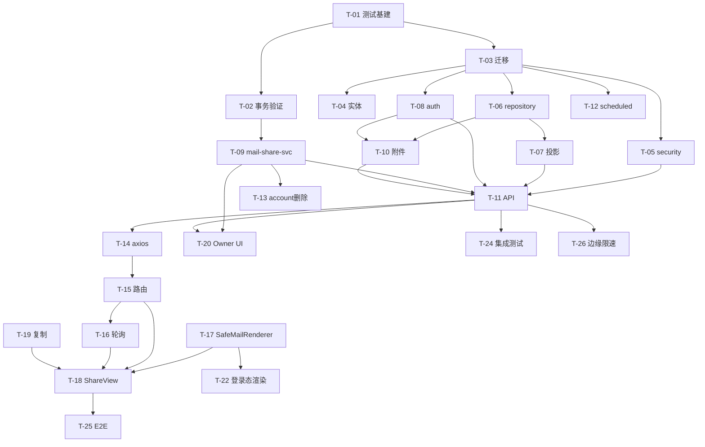

# Tasks · mail-share

> 依赖顺序执行；标 **‖** 的任务组在上一阶段门禁通过后可并行。  
> 冲突单 owner：`init.js`（T-03）、`security.js`（T-05）、`index.js`（T-12）、对象读取归一化（T-10，不修改 `r2-service.js` 本体时归一化层放在 `share-attachment-service`）。

> **Ledger 快照（2026-08-17 文档复核）**  
> `pnpm --dir mail-worker test` → **16 files / 134 passed** · `pnpm --dir mail-vue test` → **14 files / 60 passed**  
> ✅ 完成：T-01~T-17、T-19~T-22（含 logged-in 默认 HTML 跟进）、T-24、T-26~T-27  
> ⏳ 未完成：T-18（ShareView 邮件/OTP/附件 UI）、T-23（可选 · 4 处 clipboard 未收敛）、T-25（浏览器 E2E 未开始）

---

## T-01 · mail-worker 测试基础设施（阻塞项）

**依赖**：无  
**文件**：`mail-worker/vitest.config.js`、`mail-worker/package.json`、`mail-worker/wrangler-vitest.toml`（新建，**无 `[build]`**）、`mail-worker/test/setup.js`（新建）、`mail-worker/test/smoke.spec.js`（新建）

- [x] 将 `vitest.config.js` 的 `configPath` 从 `./wrangler.jsonc`（不存在）改为 `./wrangler-vitest.toml`
- [x] 新建 `wrangler-vitest.toml`：绑定**本地/内存 D1**（`d1_databases` + `migrations_dir` 或测试专用 binding），**不含** `[build]` 段，避免触发前端构建
- [x] 调整 `package.json` 脚本：`"test": "vitest run"`；原 deploy 测试语义改名为 `"test:deploy": "wrangler deploy --config wrangler-test.toml"`（避免与 vitest 冲突）
- [x] 在 `test/setup.js` 执行最小建表/seed（复用 `init.js` 迁移链或精简 DDL，含 `email`/`account` 最小列）
- [x] 编写 `test/smoke.spec.js`：对**真实 worker 入口**（`index.js` → hono）发一条请求
- [x] **红**：先写断言「某路由/health 返回预期 status/body」→ 运行 `pnpm --dir mail-worker test` → **必须看到失败**（非 ENOENT/语法错误）
- [x] **绿**：修配置/导入直至同一断言通过 → 再跑确认绿
- [x] 验收：**命令输出含 red+green 证据**；`vitest run` 不再 ENOENT

**证据（2026-08-17 复核）**  
- 测试：`mail-worker/test/smoke.spec.js` — `routes /api/* into Hono and rejects a wrong init secret`（断言 `/api/init/wrong` ≠ success）；`has isolated local D1 with email and account tables`（`env.db.prepare` INSERT/SELECT）。  
- 红→绿：Hello World 模板 vs 真实 SPA HTML（2 failed → 2 passed）；归档 `.agent-workspace/.archive/2026-08-17/t-01-mail-worker-test-harness/t-01-mail-worker-test-harness-completion.md`。  
- 全量：`pnpm --dir mail-worker test` → **16 files / 134 passed**（2026-08-17 executor 复跑）。  
- 加固：`vitest.config.js` `singleWorker: true`（Windows 多 workerd 连接失败 RCA）。

**验收 AC**：—（前置门禁，阻塞 T-02 及所有 I 层测试）

---

## T-02 · D1 事务最小验证

**依赖**：T-01  
**文件**：`mail-worker/test/transaction.spec.js`（新建）

**结论（spec-changing · 2026-08-17）**：drizzle-orm 0.42 的 D1 `.transaction()` **不可用**——驱动发出 SQL `BEGIN`，D1 在回调执行前即拒绝（`D1_ERROR`；Miniflare 与 remote 同限制）。T-09 **不得**调用 `orm(c).transaction()`。

- [x] **红**：孤儿行断言——INSERT 后 throw，无 rollback 时行残留（`expected 1 to be +0`）
- [x] **绿**：`.transaction()` 用例改为 BEGIN 拒绝断言；孤儿不变量改 `env.db.batch()` 通过
- [x] 验收：10/10 通过；归档 `.agent-workspace/.archive/2026-08-17/t-02-d1-transaction/t-02-d1-transaction-findings.md`

**证据（2026-08-17 复核）**  
- 测试：`mail-worker/test/transaction.spec.js`（10 tests）— `rejects SQL BEGIN before the callback runs`（drizzle `.transaction()` 不可用）；`leaves no orphan row after insert then a later failure (batch rollback)`（AC-SHARE-15 batch 语义）；`single-statement INSERT...SELECT MAX is atomic and returns the snapshot`（AC-SHARE-06）；`conditional INSERT...SELECT COUNT distinguishes applied from limit-hit`（AC-SHARE-12）。  
- 全量：`pnpm --dir mail-worker test` → 16 files / 134 passed。

**T-09 须采用的机制**（取代原「同事务」措辞）：
1. **窗口快照（AC-SHARE-06）**：单语句 `INSERT INTO mail_share (...) SELECT ..., COALESCE(MAX(email_id), 0) FROM email WHERE account_id = ? RETURNING ...`
2. **活跃上限（AC-SHARE-12）**：条件 INSERT `WHERE (SELECT COUNT(*) ...) < ?`；以 `RETURNING` 行数 **和/或** `meta.changes` 区分 applied/skipped
3. **Share + 幂等（AC-SHARE-15）**：`c.env.db.batch([insertShare, insertIdempotency])`；`lid` 等共用值在 JS 中预绑定，**不得** batch 内传递前序语句结果

**验收 AC**：AC-SHARE-06、AC-SHARE-12、AC-SHARE-15（D1 写路径原子性门禁——已闭合，机制为单语句 + batch，非 `.transaction()`）

---

## T-03 · v3_1DB 迁移与索引

**依赖**：T-01（单 owner：`init.js`）  
**文件**：`mail-worker/src/init/init.js`

- [x] 新增 `v3_1DB()`：`mail_share`、`share_idempotency` 表及索引（`UNIQUE(lid)`、`(user_id,status)`、`(account_id,status)`、`(delete_at)`、幂等唯一键）
- [x] 新建 `idx_email_account_id_email_id ON email(account_id, email_id)`（AC-RT-04）
- [x] 种子化 `share:manage` perm 并绑定默认角色（`role_id = 1`）——**在 `v3_1DB()` 内各用独立 try/catch INSERT**，参照 `v1_4DB:271-280` 先例，**不得**扩展 `init.js:428-463` 的 `if (permTotal === 0)` 块或 `504-518` 的 `if (rolePermCount === 0)` 块（生产库已有 perm/role_perm 行，两分支均跳过，会静默授予失败）：
  - `perm` 行：`perm_id = 37`（当前最高种子 `perm_id` 为 36，`init.js:277`）、`perm_key = 'share:manage'`、`type = 2`（`permService.userPermKeys` 只返回 `type = 2` 且 `perm_key` 非 null 的行，`perm-service.js:26-33`）
  - `role_perm` 行：`(role_id = 1, perm_id = 37)`（默认角色 `role_id = 1`、`is_default = 1`，`init.js:486-492`）
  - **勿重复 `v1_4DB` 的遗漏**：`v1_4DB:271-280` 只 INSERT 了 perm 行、**未**写 `role_perm`，权限存在但用户拿不到——`share:manage` 必须 perm + role_perm 成对种子化
- [x] 在 `init()` 注册 `v3_1DB`
- [x] 集成测试：表/索引/perm 存在

**证据（2026-08-17 复核）**  
- 测试：`mail-worker/test/v3-1-db.spec.js` — `creates mail_share, share_idempotency, and the email polling index`（sqlite_master 表名 + 命名索引）；`seeds share:manage and binds role 1 on an already-seeded deployment`（先跑完整 init 链使 count-gated 块跳过，再跑 `v3_1DB`，断言 perm + role_perm 存在）；`binds role 1 to share:manage by key when catalog id 37 is already taken`（**偏差**：审查发现硬编码 `perm_id=37` 碰撞路径后，实现改为 `perm_key` 查找 + `WHERE NOT EXISTS` 绑 role）。  
- AC-RT-04 索引**存在**：上列第一个测试；**查询计划命中**见 T-24 `share-integration.spec.js` `uses idx_email_account_id_email_id for the polling query...`。  
- AC-SHARE-01 表可写：T-09 `creates a share URL...` 经 D1 INSERT 间接验证。  
- 归档：`.agent-workspace/.archive/2026-08-17/t-03-v3-1db/t-03-v3-1db-completion.md`；perm 碰撞：`.agent-workspace/.archive/2026-08-17/mail-share-perm-id-collision/mail-share-perm-id-collision-executor.md`。

**偏差（已裁决）**：权限种子移出 count-gated 块；`role_perm` 绑定从硬编码 `perm_id=37` 改为按 `perm_key='share:manage'` 解析 id（避免 catalog 碰撞静默失败）。

**验收 AC**：AC-MGMT-03、AC-MGMT-09、AC-RT-04（索引存在）、AC-SHARE-01（表可写）

---

## T-04 · 实体与 Share 响应封装

**依赖**：T-03  
**文件**：`mail-worker/src/entity/mail-share.js`、`mail-worker/src/model/share-result.js`（新建，不吞 `0`/`''`/`false`）

- [x] 定义 `mail_share` / `share_idempotency` drizzle schema
- [x] 实现 `share-result.ok()` 等（Decision 7）
- [x] 单元测试：truthiness 不吞值

**证据（2026-08-17 复核）**  
- 测试：`mail-worker/test/mail-share.schema.spec.js` — 列名 camelCase 映射、nullable 列与 `v3_1DB` 对齐。  
- 测试：`mail-worker/test/share-result.spec.js` — `keeps 0, false, and empty string; only undefined becomes null`（Decision 7 核心断言，非文件名占位）；`documents why shareResult exists: result.ok swallows 0 / false / empty string`。  
- AC-VISIT-06 响应形状：HTTP 层见 T-11/T-24 精确 DTO 键集合断言。  
- 归档：`.agent-workspace/.archive/2026-08-17/t-04-entity-share-result/t-04-entity-share-result-completion.md`。

**验收 AC**：AC-SHARE-04、AC-VISIT-06（响应形状基础）

---

## ‖ 阶段 B · 后端核心（T-03 完成后可并行，注意单 owner）

### T-05 · security.js 分享路径鉴权（JWT 豁免 + Owner 权限门）

**依赖**：T-03（单 owner：`security.js`）  
**文件**：`mail-worker/src/security/security.js`

- [x] 两套路径集合，**不可混为一谈**：
  - **JWT 豁免**（匿名 Visitor，精确 `method + path`）：`POST /share/session`、`GET /share/mails`、`GET /share/mail`、`GET /share/attachment`
  - **权限门控**（Owner，**仍须 JWT** + `share:manage`）：`POST /mailShare/create`、`GET /mailShare/list`、`DELETE /mailShare/revoke` — 加入 `requirePerms` 与 `premKey['share:manage']` 映射（`security.js:24-62`、`64-90`），**不**放入 `exclude`
- [x] **混合匹配器**：Visitor 分享端点用精确 `method + path`；`/oss/`、`/oauth/`、`/telegram/`、`/init/` 等含动态段的既有路由**保留**受控 `startsWith` 前缀语义——禁止对整个 `exclude` 做 blanket 精确重写（会破坏合法前缀路由）
- [x] **红**：集成测试构造 `/share-evil` 路径 → 仍须 JWT（AC-LEAK-06）
- [x] **绿**：Visitor 精确匹配后通过；Owner 缺 `share:manage` → `SHARE_FORBIDDEN`；**回归**：既有 `/public/*`、`/oss/*`、`/oauth/*` 等前缀行为不变
- [x] 标注回归风险：Visitor 精确匹配 + 保留前缀路由的混合改动

**证据（2026-08-17 复核）**  
- 测试：`mail-worker/test/security-share.spec.js`（27 tests）。  
  - AC-LEAK-06：`GET /share-evil without JWT still requires JWT`（及 `/shareanything`、`/share/mailbox`、`/share/mails/extra`）。  
  - Visitor 精确豁免：`GET /share/mails with query string is not JWT-gated`。  
  - Owner 权限门：`POST/GET/DELETE /mailShare/* without share:manage returns SHARE_FORBIDDEN`；有权限时 `is not SHARE_FORBIDDEN`。  
  - 前缀回归：`GET /oss/<key>`、`/oauth/<dynamic>`、`/public/genToken`、`/setting/websiteConfig` 行为不变；`/setting/websiteConfigAnything` 仍须 JWT。  
- AC-VISIT-08（写操作 JWT 门控）：同文件 `AC-VISIT-08 writes stay JWT-gated`；**有效 share session 不能写**见 T-24 `rejects write APIs that a visitor session token must never perform`。  
- 归档：`.agent-workspace/.archive/2026-08-17/t-05-security-share-auth/t-05-security-share-auth-completion.md`。

**验收 AC**：AC-LEAK-06、AC-VISIT-08（写操作仍被拒）

---

### T-06 · share-scoped-email-repository

**依赖**：T-03  
**文件**：`mail-worker/src/service/share-scoped-email-repository.js`（新建）

- [x] 实现 `list(c, ctx, cursor, limit)` / `getById(c, ctx, mailId)`：恒含 `account_id=ctx.accountId`（`>0`）、`email_id>windowStart`、`is_del=NORMAL`、`status!=SAVING`
- [x] **红**：property/集成——插入 `account_id=0`、`SAVING` 中间态、窗口外邮件 → 均不返回
- [x] **绿**：实现通过

**证据（2026-08-17 复核）**  
- 测试：`mail-worker/test/share-scoped-email-repository.spec.js` — `list does not return orphan, mid-write, below-window, or other-account rows`（P-SCOPE-01）；`getById returns null for every out-of-scope id...`（AC-VISIT-09）；`refuses to retrieve rows when ctx.accountId is 0`；`same cursor re-read does not duplicate or skip...`（AC-RT-09）。  
- HTTP 层同 poison 行：T-24 `keeps account_id=0, mid-write, below-window, and foreign mail off every visitor route`。  
- 归档：`.agent-workspace/.archive/2026-08-17/t-06-share-scoped-email-repository/t-06-share-scoped-email-repository-completion.md`。

**验收 AC**：AC-VISIT-05、AC-VISIT-09、AC-VISIT-16、P-SCOPE-01

---

### T-07 · share-mail-service 投影

**依赖**：T-06  
**文件**：`mail-worker/src/service/share-mail-service.js`（新建）

- [x] `project()` 白名单键映射；`code` 原样（空串不展示逻辑在 DTO/前端）
- [x] attachments `downloadUrl` → `/share/attachment?...`
- [x] **红**：property 键集合恒等

**证据（2026-08-17 复核）**  
- 测试：`mail-worker/test/share-mail-service.spec.js` — `output key set is exactly the whitelist when the row carries extra internal columns`（P-PROJ-01，键集合 `Object.keys` 恒等）；`keeps empty-string code intact`（AC-OTP-14）；`does not infer a code from subject or text when code is empty`（AC-OTP-15）；`attachment downloadUrl points at /share/attachment and never /oss/`（AC-SEC-20）。  
- HTTP 白名单：T-24 visitor journey 断言 list/detail DTO 精确键 + `code` passthrough。  
- 归档：`.agent-workspace/.archive/2026-08-17/t-07-share-mail-service/t-07-share-mail-service-completion.md`。

**验收 AC**：AC-VISIT-06、AC-OTP-14、AC-OTP-15、AC-SEC-20、P-PROJ-01

---

### T-08 · share-auth-service

**依赖**：T-03、T-04  
**文件**：`mail-worker/src/service/share-auth-service.js`（新建）

- [x] `establishSession`：lid 定位 + HMAC 常量时间比较 + `pepper_kid` 双 PEPPER 窗口
- [x] 签发无状态 HMAC sessionToken（payload 含 `shareId,lid,iat,exp,kid`）
- [x] `resolveSession`：验签 → 查库 → `effectiveStatus` → account 有效
- [x] `access_count`/`last_access_at` 更新；失败不阻断 Session（AC-LIFE-14）
- [x] 新建 `SHARE_SEC_PEPPER`、`SHARE_SESSION_SIGNING_KEY` env + kid 双 key 验签
- [x] **红**：四种非法输入响应形状相同（AC-VISIT-04）

**证据（2026-08-17 复核）**  
- 测试：`mail-worker/test/share-auth-service.spec.js` — `returns byte-identical SHARE_UNAVAILABLE envelopes for illegal visitor inputs`（AC-VISIT-04 / P-AUTH-01，**逐字节**比较 envelope）；`rejects a token on the next request after the share is revoked`（AC-VISIT-07 / AC-LIFE-03）；`treats expiry as computed from expires_at...`（AC-LIFE-01）；`validates a share hashed with the previous pepper after rotation`（AC-VISIT-03）；`still issues a session when access accounting fails`（AC-LIFE-14）；`increments access_count only on successful establish`（AC-LIFE-10）；`does not write sec or session token to logs`（AC-LEAK-05）。  
- HTTP 层不可区分错误扩展：T-24 `returns byte-identical HTTP SHARE_UNAVAILABLE for every illegal visitor input`（含 feature off、窗口外邮件、`?sec=` 无 Bearer 等）。  
- 归档：`.agent-workspace/.archive/2026-08-17/t-08-share-auth-service/t-08-share-auth-service-completion.md`。

**验收 AC**：AC-VISIT-03、AC-VISIT-04、AC-VISIT-07、AC-VISIT-11、AC-LIFE-01、AC-LIFE-03、AC-LIFE-09、AC-LIFE-10、AC-LIFE-14、AC-ABUSE-03（Visitor 侧）、AC-LEAK-05

---

### T-09 · mail-share-service（Owner 写路径）

**依赖**：T-02、T-03、T-08  
**文件**：`mail-worker/src/service/mail-share-service.js`（新建）

- [x] `create`：**单语句**窗口快照 `INSERT ... SELECT MAX(email_id) ...`（AC-SHARE-06）；CSPRNG lid/sec；不存 sec 明文
- [x] 幂等：24h 重放/冲突（AC-SHARE-11/14）；Share + 幂等行 **`c.env.db.batch()`** 原子提交（AC-SHARE-15）；活跃上限**条件 INSERT**（AC-SHARE-12）
- [x] `list`/`revoke`；Owner 字段投影
- [x] account 归属校验（AC-SHARE-05）
- [x] **红→绿**：并发上限、幂等冲突、窗口快照

**证据（2026-08-17 复核）**  
- 测试：`mail-worker/test/mail-share-service.spec.js`（21 tests）— 逐 AC 命名断言，例如：`linearises the window snapshot in one INSERT...SELECT`（AC-SHARE-06）；`does not let concurrent creates exceed the active limit`（AC-SHARE-12）；`commits share and idempotency together so a limit miss leaves no orphan key`（AC-SHARE-15）；`stores HMAC(sec, pepper) and never persists plaintext sec`（AC-SHARE-03）；`replays the same Idempotency-Key without a second share or sec`（AC-SHARE-11）；`rejects a same-key different-body replay`（AC-SHARE-14）。  
- HTTP 并发/幂等：T-24 `does not let concurrent HTTP creates exceed the active cap`；`replays one Idempotency-Key...`；`treats a concurrent replay of the same Idempotency-Key as one share`。  
- 归档：`.agent-workspace/.archive/2026-08-17/t-09-mail-share-service/t-09-mail-share-service-completion.md`。

**偏差（已裁决）**：不用 drizzle `.transaction()`（T-02）；窗口快照 = 单语句 `INSERT ... SELECT COALESCE(MAX(email_id),0)...`；Share+幂等 = `c.env.db.batch()`；活跃上限 = 条件 INSERT + `RETURNING`/`meta.changes` 区分 applied/skipped。

**验收 AC**：AC-SHARE-01~12、AC-SHARE-14~16、AC-MGMT-01~02、AC-MGMT-07、AC-MGMT-09、AC-LIFE-02~04、AC-LIFE-06~08、AC-LIFE-13、AC-ABUSE-02~03

---

### T-10 · share-attachment-service + 对象读取归一化

**依赖**：T-06、T-08（单 owner：归一化层）  
**文件**：`mail-worker/src/service/share-attachment-service.js`（新建）

- [x] 实现 `normalizeObjectResponse(kv|r2|s3)`：统一为 `Response` 或 `{body,httpMetadata}`（`r2-service.js:43-56` 返回类型不一致）
- [x] `GET /share/attachment`：ShareAuth 鉴权 → 归一化 → Worker 回传字节
- [x] **红**：Share 过期/撤销后下载拒绝；未归一化 R2 路径不崩溃

**证据（2026-08-17 复核）**  
- 测试：`mail-worker/test/share-attachment-service.spec.js`（14 tests）— `normalizes an R2Object to one Response with Cache-Control no-store`（归一化不崩溃）；`rejects download when resolveSession says the share is expired or revoked`；`rejects when the mail is outside the share visible window`；`returns bytes with Cache-Control no-store when the attachment is in scope`（AC-SEC-21 / P-ATT-01）。  
- HTTP：T-11/T-24 visitor journey 经 `/share/attachment` 取字节；撤销后四路由一致失败。  
- 归档：`.agent-workspace/.archive/2026-08-17/t-10-share-attachment-service/t-10-share-attachment-service-completion.md`。

**验收 AC**：AC-SEC-21、P-ATT-01

---

### T-11 · API 路由注册

**依赖**：T-05、T-07~T-10  
**文件**：`mail-worker/src/api/share-api.js`、`mail-worker/src/api/mail-share-api.js`（新建）、`mail-worker/src/hono/webs.js`

- [x] Visitor：`POST /share/session`、`GET /share/mails`、`GET /share/mail`、`GET /share/attachment`
- [x] Owner：`POST /mailShare/create`、`GET /mailShare/list`、`DELETE /mailShare/revoke`
- [x] 分享 API 响应 `Cache-Control: no-store`（AC-LEAK-02）
- [x] `limit` 上限 50（AC-RT-08）；游标语义（AC-RT-09/12）

**证据（2026-08-17 复核）**  
- 测试：`mail-worker/test/share-api.spec.js`（6 tests）— `runs owner create through visitor read then identical failures after revoke`（AC-VISIT-01/02 后端路径、AC-LEAK-02 response header）；`caps visitor list limit at 50 when the client asks for 500`（AC-RT-08）；`pages with a stable cursor that neither duplicates nor skips`（AC-RT-09）；`does not mutate share or mail rows on GET /share/mails or GET /share/mail`（AC-VISIT-16）；`returns byte-identical SHARE_UNAVAILABLE for the four visitor failure modes`（AC-VISIT-04 子集）。  
- 端到端旅程：T-24 `runs the visitor journey through the worker entry...`（含 `/s/<lid>` 不 bump access_count — AC-VISIT-02 SPA 侧仍待 T-18/T-25）。  
- 归档：`.agent-workspace/.archive/2026-08-17/t-11-share-api/t-11-share-api-completion.md`。

**验收 AC**：AC-VISIT-01~02、AC-RT-08~09、AC-RT-12、AC-RT-16、AC-LEAK-02、AC-SHARE-07~09

---

### T-12 · scheduled 清理任务

**依赖**：T-03（单 owner：`index.js`）  
**文件**：`mail-worker/src/index.js`、`mail-worker/src/service/mail-share-cleanup-service.js`（新建）

- [x] 扩展 `scheduled()`：删除 `delete_at` 到期 Share；删除 24h 过期幂等行
- [x] **红→绿**：造两条 delete_at 未到/已到，跑 cron handler，只删后者

**证据（2026-08-17 复核）**  
- 测试：`mail-worker/test/mail-share-cleanup.spec.js` — `deletes only past delete_at shares and 24h-stale idempotency via the daily cron`（AC-LIFE-07：未来 `delete_at` 行保留，过期行与 stale 幂等行删除）。  
- 归档：`.agent-workspace/.archive/2026-08-17/t-12-scheduled-cleanup/t-12-scheduled-cleanup-completion.md`。

**验收 AC**：AC-LIFE-07

---

### T-13 · account 删除挂钩撤销 Share

**依赖**：T-09  
**文件**：`mail-worker/src/service/account-service.js`（扩展删除路径）

- [x] 软删/硬删 account 时 REVOKE 相关 MailShare（AC-LIFE-09/12 删除侧）
- [x] **红→绿**：删 account 后 Visitor `SHARE_UNAVAILABLE`
- [x] **不实施**转移路径（能力不存在；AC-LIFE-12 转移为未来挂钩）

**证据（2026-08-17 复核）**  
- 测试：`mail-worker/test/account-delete-share.spec.js`（5 tests）— `soft-deletes a mailbox, then the visitor cannot read and the share row is revoked`；`keeps the share revoked after the mailbox is restored`（AC-LIFE-09）；`hard-deletes...`；`revokes every active share of accounts removed with the user`。  
- HTTP：T-24 `makes visitor HTTP fail identically after the mailbox is deleted`（AC-LIFE-09 访客路径）。  
- 归档：`.agent-workspace/.archive/2026-08-17/t-13-account-delete-share/t-13-account-delete-share-completion.md`。

**验收 AC**：AC-LIFE-09、AC-LIFE-12（删除路径）

---

## ‖ 阶段 C · 前端（可与阶段 B 后半并行，依赖对应 API mock/就绪）

### T-14 · 独立 axios 实例

**依赖**：T-11（或 contract stub）  
**文件**：`mail-vue/src/request/share.js`（新建）

- [x] 不发 `Authorization` 除非显式 Bearer sessionToken；401 不跳登录；403 不 reload
- [x] 429 保留为运输层错误

**证据（2026-08-17 复核）**  
- 测试：`mail-vue/src/request/share.spec.js`（7 tests）— `does not send Authorization when no share session token is supplied`（AC-VISIT-11）；`hands back HTTP 200 SHARE_UNAVAILABLE without redirect or reload`；`hands back a business 401 without clearing the user token or navigating`；`surfaces HTTP 429 as a recoverable rate limit with Retry-After`（AC-ABUSE-09 / AC-RT-15）；`does not reload on HTTP 403`。  
- 全量：`pnpm --dir mail-vue test` → 14 files / 60 passed。  
- 归档：`.agent-workspace/.archive/2026-08-17/t-14-share-http-client/t-14-share-http-client-completion.md`。

**验收 AC**：AC-VISIT-11、AC-ABUSE-09、AC-RT-15

---

### T-15 · 分享路由与守卫

**依赖**：T-14  
**文件**：`mail-vue/src/router/index.js`、`mail-vue/src/views/share/index.vue`（新建）、分享 async chunk 依赖图断言（CI 脚本）

- [x] 顶层兄弟路由 `share`；守卫 `name==='share'` 直接 `next()`
- [x] fragment 读取 sec → 立即 `replaceState` 清 fragment
- [x] sessionStorage `share:session:<lid>` 读写/清理（AC-VISIT-12~15）
- [x] chunk 不静态导入 `db.js`/`layout/**`/`axios/index.js`/阻塞性 `websiteConfig()`

**证据（2026-08-17 复核）**  
- 测试：`mail-vue/src/router/index.spec.js` — `registers share as a top-level sibling of layout`；`lets an anonymous visitor open /s/:lid without a login token`（AC-VISIT-01/10）；`clears the fragment during the share guard before the view runs`；leave-route / multi-lid 隔离。  
- 测试：`mail-vue/src/views/share/session.spec.js` — `reads sec from the fragment and immediately replaceState-clears it`；`namespaces the session key by lid`（AC-VISIT-12~15）。  
- 测试：`mail-vue/src/views/share/index.spec.js` — session establish / refresh / fail / unavailable / exit / 429 不清 token。  
- 测试：`mail-vue/src/views/share/share-chunk.spec.js` — built chunk 无 Dexie/layout/axios-index/websiteConfig（真实 `vite build` 产物断言）。  
- 归档：`.agent-workspace/.archive/2026-08-17/t-15-share-route/t-15-share-route-completion.md`。

**验收 AC**：AC-VISIT-01、AC-VISIT-10、AC-VISIT-12~15

---

### T-16 · useSharePolling composable

**依赖**：T-14、T-15  
**文件**：`mail-vue/src/composables/useSharePolling.js`（新建）

- [x] 3s 增量轮询；`visibilitychange` 后台暂停；`onUnmounted` abort；429 读 `Retry-After`
- [x] Share 失效停轮询（AC-RT-16）
- [x] **非**复用 `email/index.vue` 内联 while

**证据（2026-08-17 复核）**  
- 测试：`mail-vue/src/composables/useSharePolling.spec.js`（6 tests）— `does not poll again after the calling scope is disposed`（AC-RT-14 unmount）；`does not poll while the page is hidden`（AC-RT-05）；`waits Retry-After on 429 instead of retrying immediately`（AC-RT-15）；`stops polling after SHARE_UNAVAILABLE`（AC-RT-16）；cursor 推进 + AbortSignal。  
- 归档：`.agent-workspace/.archive/2026-08-17/t-16-use-share-polling/t-16-use-share-polling-completion.md`。

**验收 AC**：AC-RT-05、AC-RT-14~16

---

### T-17 · SafeMailRenderer

**依赖**：无（可与 T-15 并行）  
**文件**：`mail-vue/src/components/safe-mail/`（新建）

- [x] sandbox iframe + srcdoc + 内层 CSP `script-src 'none'`
- [x] 默认纯文本；HTML 模式固定高度+内层滚动
- [x] `text` 空+有 HTML → 默认直接 iframe + UI 说明（AC-SEC-24）
- [x] 注入失败降级纯文本（AC-SEC-14）
- [x] 外链 `target=_blank` + `rel=noopener noreferrer`（AC-SEC-07）

**证据（2026-08-17 复核）**  
- 测试：`mail-vue/src/components/safe-mail/srcdoc.spec.js`（`node --test`，15 tests）— `omits allow-scripts and allow-same-origin`（AC-SEC-09）；`wraps a fragment with CSP script-src none`（AC-SEC-15/16）；`adds target and rel on a bare anchor`（AC-SEC-07）；`uses sandboxed html plus notice when text is missing`（AC-SEC-24）；`returns ok false instead of throwing on invalid input`（AC-SEC-14）。  
- 测试：`mail-vue/src/components/safe-mail/index.spec.js`（vitest）— `share-style default stays plain text when both parts exist`（AC-SEC-01 分享默认）；`starts taller than the T-22 480px letterbox and expands on click`。  
- Chromium harness：T-17 归档 9/9（script/onerror 未执行；固定高度滚动）。  
- 归档：`.agent-workspace/.archive/2026-08-17/t-17-safe-mail-renderer/t-17-safe-mail-renderer-completion.md`。

**验收 AC**：AC-SEC-01~02、AC-SEC-07、AC-SEC-09、AC-SEC-14~16、AC-SEC-22~24

---

### T-18 · ShareView 页面

**依赖**：T-15~T-17  
**文件**：`mail-vue/src/views/share/**`

- [ ] 会话建立 → 邮件列表/详情 → OTP 展示/复制 → 附件列表/下载
- [ ] 零第三方脚本

**进度（2026-08-17 · 诚实拆分）**  
- **已完成（T-15 壳层）**：`views/share/index.vue` 仅会话建立 + 状态机（loading/ready/unavailable/limited/exited）；`data-share-body` 占位空；7 项 session 生命周期测试绿（`index.spec.js` + `session.spec.js`）。  
- **未完成**：未挂载 `useSharePolling`、未渲染邮件列表/详情、未接 SafeMailRenderer、无 OTP 复制 UI、无附件下载 UI — AC-OTP-07~08、AC-SEC-20/23 页面层仍属 **E/M · T-25**。  
- 代码锚点：`mail-vue/src/views/share/index.vue` 第 12 行 `

` 仍为空。

**验收 AC**：AC-OTP-07~08、AC-VISIT-01、AC-SEC-20、AC-SEC-23

---

### T-19 · useCopyWithFallback composable

**依赖**：无  
**文件**：`mail-vue/src/composables/useCopyWithFallback.js`（新建）

- [x] Clipboard API + 手动选中降级 DOM
- [x] **红→绿**：mock clipboard 拒绝时仍有可选中文本

**证据（2026-08-17 复核）**  
- 测试：`mail-vue/src/composables/useCopyWithFallback.spec.js`（5 tests）— `exposes selected fallback text when clipboard.writeText rejects`（AC-OTP-09 核心）；`falls back to execCommand...`；`selects a caller-bound element on the manual path`。  
- 红→绿：4 failed → 5 passed（归档 T-19）。  
- 归档：`.agent-workspace/.archive/2026-08-17/t-19-use-copy-with-fallback/t-19-use-copy-with-fallback-completion.md`。

**验收 AC**：AC-OTP-09

---

### T-20 · Owner 管理 UI

**依赖**：T-09、T-11  
**文件**：`mail-vue/src/views/email/**` ShareDialog、ShareIndicator 等（新建/扩展）

- [x] 创建/列表/销毁；确认对话框；风险提示文案
- [x] 活跃分享计数（AC-MGMT-04）
- [x] Idempotency-Key 请求头

**证据（2026-08-17 复核）**  
- 测试：`mail-vue/src/views/email/ShareDialog.spec.js`（6 tests）— `shows the access-risk warning before create is available`（AC-MGMT-06）；`shows the create secret once and never copies it from a later list`（AC-SHARE-04 / AC-LEAK-01）；`sends the same Idempotency-Key when create is retried`（AC-SHARE-11）；`does not revoke until the owner confirms destruction`（AC-MGMT-05）；`renders the API effectiveStatus instead of recomputing expiry`（AC-LIFE-08）。  
- 测试：`mail-vue/src/views/email/ShareIndicator.spec.js` — `shows the ACTIVE share count for the current mailbox only`（AC-MGMT-04）。  
- 测试：`mail-vue/src/request/mail-share.spec.js` — `sends Idempotency-Key on create`；`lists and revokes through the logged-in client`。  
- 测试：`mail-vue/src/views/email/build-share-url.spec.js` — fragment-only URL（AC-LEAK-01）。  
- 归档：`.agent-workspace/.archive/2026-08-17/t-20-owner-share-ui/t-20-owner-share-ui-completion.md`。

**验收 AC**：AC-MGMT-04~07、AC-SHARE-01~04、AC-SHARE-09~11、AC-LEAK-01

---

### T-21 · 安全响应头

**依赖**：无  
**文件**：`mail-vue/public/_headers`（**源文件**，非 `mail-worker/dist/_headers`）

- [x] `/s/*`：`Cache-Control: no-store`、`Referrer-Policy: no-referrer`、`X-Robots-Tag: noindex,nofollow`、外层 CSP（design.md 匿名 Bootstrap；`img`/`style`/`font`/`media` 含 `http:`/`https:` 因 srcdoc 继承父 CSP）
- [x] release 构建验证产物含头

**证据（2026-08-17 复核）**  
- 产物：`pnpm --dir mail-vue run build` 复制 `_headers` → `mail-worker/dist/_headers`（895 bytes；三条原 cache 规则 + `/s/*` 四头）。  
- **偏差（已裁决）**：外层 CSP 的 `img-src`/`style-src`/`font-src`/`media-src` 放宽为含 `http:`/`https:` — `srcdoc` iframe **继承父文档 CSP**（CSP3 §7.8）；字面 `img-src 'self'` 会阻断邮件内远程图片（AC-SEC-23）。  
- **未闭合**：`run_worker_first=true` 下 Pages/Assets 是否**运行时**应用 `_headers` — 仅构建产物验证，无 deploy 证据（见文末 §人工确认）。  
- AC-LEAK-02~04 的**浏览器**断言仍属 T-25（M 层）。  
- 归档：`.agent-workspace/.archive/2026-08-17/t-21-share-headers/t-21-share-headers-completion.md`。

**验收 AC**：AC-LEAK-02~04

---

### T-22 · 登录态详情页切换 SafeMailRenderer

**依赖**：T-17  
**文件**：`mail-vue/src/views/content/index.vue`

- [x] 替换 `shadow-html` 裸 innerHTML 路径（AC-SEC-10）
- [x] **跟进（2026-08-17）**：登录态默认 HTML 模式 + 更高默认框高 + 可展开（用户裁决；分享页仍默认纯文本）

**证据（2026-08-17 复核）**  
- 测试：`mail-vue/src/views/content/index.spec.js`（5 tests）— `uses SafeMailRenderer instead of ShadowHtml after XSS fix 2026-08-17`（AC-SEC-10）；`asks SafeMailRenderer for HTML as the logged-in default`（跟进：`default-mode="html"`）；`keeps HTML-only mail on SafeMailRenderer when text is empty`（AC-SEC-24）；`rewrites {{domain}} on HTML before it reaches the sandboxed renderer`。  
- 测试：`mail-vue/src/components/safe-mail/index.spec.js` — `logged-in defaultMode html shows the sandbox iframe immediately`；`starts taller than the T-22 480px letterbox and expands on click`。  
- Chromium：T-22 归档 5 fixtures 渲染通过；`shadow-html` 已删（唯一消费者为此 view）。  
- **分享页默认模式**：SafeMailRenderer 默认 `defaultMode='text'`；T-18 未挂载 renderer — 分享 vs 登录态 per-consumer 默认已在组件层验证，页面接线待 T-18。  
- 归档：`.agent-workspace/.archive/2026-08-17/t-22-logged-in-safe-mail/t-22-logged-in-safe-mail-completion.md`；跟进：`.agent-workspace/.archive/2026-08-17/t-22-followup-logged-in-html-default/t-22-followup-logged-in-html-default-completion.md`。

**验收 AC**：AC-SEC-10

---

### T-23（可选）· 收敛 4 处复制逻辑

**依赖**：T-19  
**文件**：`reg-key/index.vue`、`layout/account/index.vue`、`layout/header/index.vue`、`components/email-scroll/index.vue`

- [ ] 可选：4 处改用 `useCopyWithFallback`

**进度（2026-08-17 · 未收敛）**  
- T-19 composable 已绿；**Owner ShareDialog** 已使用（T-20）。  
- 下列 4 处仍为直接 `navigator.clipboard.writeText`（`grep` 命中）：`reg-key/index.vue:263`、`layout/account/index.vue:370`、`layout/header/index.vue:169`、`components/email-scroll/index.vue:672`。  
- 存在预备测试 `layout/header/index.copy.spec.js`（T-23 标题），但 **header 源码未改** — 不算完成。

**验收 AC**：—（范围控制可选项）

---

## 阶段 D · 集成 / E2E / 运维

### T-24 · 后端集成测试套件

**依赖**：T-01~T-13  
**文件**：`mail-worker/test/share-*.spec.js`

- [x] 覆盖状态机、投影、不可区分错误、EXPLAIN 索引（AC-RT-04）、并发上限
- [x] 每条 I 层 AC 至少一条测试引用

**证据（2026-08-17 复核）**  
- 新增：`mail-worker/test/share-integration.spec.js`（13 tests）— 闭合先前「测了也会绿 if impl wrong」的 HTTP I/P 洞；详见 `.agent-workspace/.archive/2026-08-17/t-24-share-integration/t-24-share-integration-findings.md`。  
- 关键断言（会真失败的那种）：  
  - `uses idx_email_account_id_email_id for the polling query and not a table scan`（AC-RT-04 **EXPLAIN**，非仅 index exists）  
  - `uses idx_mail_share_user_id_status for the owner list query`（AC-MGMT-03 EXPLAIN）  
  - `returns byte-identical HTTP SHARE_UNAVAILABLE for every illegal visitor input`（P-AUTH-01 / AC-VISIT-04 扩展集）  
  - `keeps account_id=0, mid-write, below-window, and foreign mail off every visitor route`（P-SCOPE-01 HTTP）  
  - 并发 cap / 幂等 / 生命周期 / account 删除 / visitor 写拒绝 / cursor 重连（见该文件 13 个 `it` 标题）。  
- 全仓 worker 套件：`pnpm --dir mail-worker test` → **16 files / 134 passed**（含全部 `share-*.spec.js` + `transaction.spec.js` + per-task specs）。  
- **仍属 ops / M 层**：生产量级 EXPLAIN、全部 E/M Traceability 行（见 findings §Cannot be tested at this layer）。

**验收 AC**：全部 I/P 层矩阵项（见 design.md Traceability）

---

### T-25 · 浏览器 E2E

**依赖**：T-15~T-22、可部署环境  
**文件**：手动/E2E 脚本（`tests/e2e/` 或 Playwright，若新建须放 tests/）

- [ ] 全新上下文：有效/随机/过期/销毁链接
- [ ] 真实投递邮件 → 3s 内出现（AC-RT-14）
- [ ] 后台暂停、429 退避、Session 清理、附件负例

**状态（2026-08-17）**：**未开始**。无 `tests/e2e/` Playwright 脚本；requirements Success State 要求「单测绿不算完成，必须真跑一次端到端」。当前仅有 Vitest/jsdom/Chromium 组件级 harness（T-17/T-22），**不能**替代本任务。

**验收 AC**：全部 E/M 层矩阵项

---

### T-26 · Cloudflare Rate Limiting 配置

**依赖**：T-11  
**文件**：部署文档 / Cloudflare 控制台（非代码仓，或 `docs/deploy/` 记录）

- [x] `POST /share/session` 限速规则；429 + `Retry-After`

**证据（2026-08-17 复核）**  
- 测试：`mail-worker/test/share-rate-limit.spec.js`（7 tests）— `returns HTTP 429 with Retry-After when the session limiter denies`（AC-ABUSE-08 / P-TRANS-01）；`keys the limiter on CF-Connecting-IP and ignores X-Forwarded-For and lid`；`leaves thrown errors as HTTP 200 via onError so 429 must be a returned Response`（429 不被全局 onError 改写成 200）。  
- **偏差（已裁决）**：限速键仅 `CF-Connecting-IP`；**故意不对 `lid` 上锁**（防 per-link 误伤/枚举差异）。  
- **未闭合**：Cloudflare 控制台真实规则的 per-location 行为、429 响应体是否稳定 JSON — 需 deploy 后人工确认（见文末）。  
- 归档：`.agent-workspace/.archive/2026-08-17/t-26-share-rate-limit/t-26-share-rate-limit-completion.md`。

**验收 AC**：AC-ABUSE-08

---

### T-27 · mail-vue 测试基础设施（与 T-01 对称）

**依赖**：无（可与 Wave 1 前端任务并行）  
**文件**：`mail-vue/vitest.config.js`、`mail-vue/package.json`、`mail-vue/src/test/setup.js`

- [x] `"test": "vitest run"`；合并 `vite.config.js`（`mode: 'test'`）且剥离 PWA
- [x] `outDir` 不写入 `mail-worker/dist`（避免 release 构建污染 worker 产物）
- [x] jsdom + Vue Test Utils；现有 `useCopyWithFallback.spec.js` 纳入 vitest
- [x] **红→绿**：hamburger 组件 smoke

**证据（2026-08-17 复核）**  
- 命令：`pnpm --dir mail-vue test` → **14 files / 60 passed**（2026-08-17 executor 复跑）。  
- 测试：含 T-19 `useCopyWithFallback.spec.js`（5）、T-15~T-22 前端 specs；`srcdoc.spec.js` 仍走 `node --test`（T-17 遗留，vitest exclude）。  
- 归档：`.agent-workspace/.archive/2026-08-17/t-27-mail-vue-test-runner/t-27-mail-vue-test-runner-completion.md`。

**验收 AC**：—（前置门禁，阻塞 mail-vue 层组件/路由测试）

---

## 依赖总览

**可并行组**：
- **‖-1**（T-03 后）：T-05、T-06、T-08、T-12、T-17、T-19、T-21
- **‖-2**（T-06+T-08 后）：T-07、T-09、T-10
- **‖-3**（T-11 后）：T-14~T-16、T-20、T-26
- **‖-4**（T-15~T-17 后）：T-18、T-22

---

## AC 覆盖自查（active · 88 + 新增 2 = 90）

| 域 | Active AC | 负责任务 |
|---|---|---|
| SHARE | 01-12,14-16 | T-03,T-04,T-09,T-11,T-20,T-24 |
| VISIT | 01-16 | T-05~T-08,T-11,T-14~T-18,T-24,T-25 |
| LIFE | 01-04,06-10,12-14 | T-08,T-09,T-12,T-13,T-24 |
| RT | 04-05,08-09,12,14-16 | T-03,T-06,T-11,T-16,T-24,T-25 |
| OTP | 07-09,14-15 | T-07,T-18,T-19,T-25 |
| SEC | 01-02,07,09-10,14-16,20-24 | T-10,T-17,T-18,T-22,T-24,T-25 |
| MGMT | 01-07,09 | T-03,T-09,T-11,T-20,T-24 |
| LEAK | 01-06 | T-05,T-08,T-11,T-15,T-20,T-21,T-25 |
| ABUSE | 02-04,08-09 | T-08,T-09,T-14,T-16,T-26,T-25 |

**遗漏**：无（deprecated AC 未排入任务；AC-SHARE-16 复合游标退路本期不实施——T-02 证实单语句快照已足够，无需复合游标）

---

## 开工前仍需人工/运行时确认

以下**无法**从静态代码或 Vitest  alone 闭合，须在 **T-25 浏览器 E2E** 或 **上线 deploy** 前确认：

1. **浏览器矩阵（T-25 · 阻塞发布证据）**：Chromium / Firefox / Safari 下 sandbox、srcdoc、CSP、外链 `target=_blank`、固定高度 iframe、OTP 复制降级 — 当前仅有 T-17/T-22 的 Chromium 组件 harness
2. **E2E 场景清单（T-25 · 未开始）**：全新浏览器上下文、有效/随机/过期/销毁链接、真实投递邮件 → 3s 内列表出现（AC-RT-14）、后台暂停轮询、429 退避、Session 清理、附件负例、同 tab 切换两 Share、撤销中轮询
3. **`EXPLAIN QUERY PLAN` 生产量级（AC-RT-04）**：本地 D1 + ANALYZE + 噪声行已在 T-24 验证索引**选用**；最大 `email` 表行数、单 Account 邮件量、峰值写入速率仍未知 — 需生产/预发 cardinality
4. **`run_worker_first=true` 下 `_headers` 应用时机（T-21）**：构建产物 `mail-worker/dist/_headers` 已含 `/s/*` 规则；Pages/Assets 是否在运行时对 `/s/<lid>` **实际下发** Referrer-Policy / CSP / no-store — **未 deploy 验证**
5. **Cloudflare 边缘限速真实行为（T-26）**：Workers Rate Limiting 在控制台的 per-location 规则、429 响应体是否统一 JSON、是否稳定携带 `Retry-After`（AC-ABUSE-08）— 本地为 mock limiter（`share-rate-limit.spec.js`）
6. **附件元数据与对象存储时序**：附件行是否可能晚于邮件 `completeReceive` 可见
7. **软删 account 后鉴权行为**：软删 account 是否仍被 `share-auth-service` 视为失效（AC-LIFE-09 运行时负例；HTTP 路径已在 T-24 覆盖 hard/soft delete 挂钩）
8. **Dexie 两次 `.version(1)` 语义**（与分享无关，但影响登录态回归）
9. **预计负载**：并发 Share 数、单 Share Visitor 数、3s 轮询 QPS 容量估算
10. **T-18 未完成**：访客 ShareView 邮件/OTP/附件 UI 未接线 — Success State 端到端仍缺此块 + T-25

---

## 本期不做 / 后续

- `PUT /mailShare/regenerate`（deprecated AC-SHARE-13、AC-LIFE-05/11）
- 服务端 `/share/wait` 长轮询（deprecated AC-RT-01~03/06/07/10/11）
- 确定性 OTP 打分器（deprecated AC-OTP-01~06/10~13）
- DOMPurify 净化（deprecated AC-SEC-03~06/08/11~13）
- 公开 `/oss/` 直链附件（deprecated AC-SEC-18/19）
- AC-SHARE-16 复合游标退路（T-02 证实单语句 `INSERT ... SELECT MAX(...)` 已提供线性化切点，本期不实施）
- Account **转移**挂钩（AC-LIFE-12 保留，等转移能力出现）
- 修复既有 `/oss/*` 零鉴权缺陷（design.md 既有缺陷 #1）
